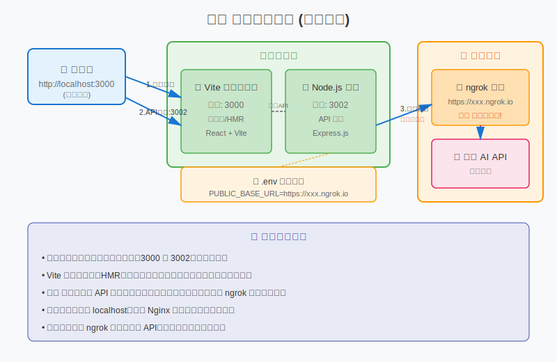
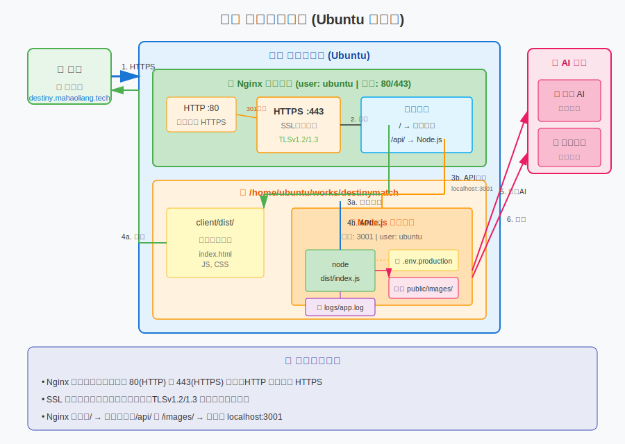
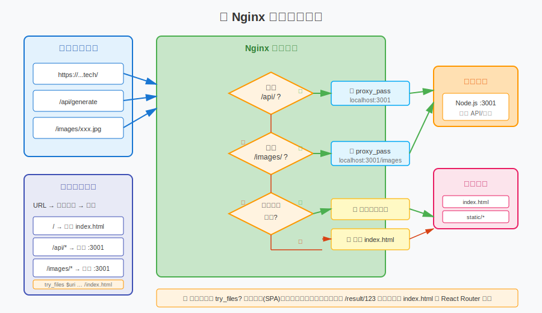

# Destiny Match 快捷操作手册

## 一、开发环境（本地开发调试）

### 1.1 启动应用

**方式一：同时启动前后端（推荐）**
```bash
cd /Users/haoliangma/Documents/works/webapp/destiny-match
npm run dev
```
- 前端地址：http://localhost:3000（或自动分配的其他端口）
- 后端地址：http://localhost:3002
- 按 `Ctrl+C` 同时停止前后端

**方式二：分别启动（调试单个服务时用）**
```bash
# 终端1：启动后端
cd /Users/haoliangma/Documents/works/webapp/destiny-match
npm run dev:server

# 终端2：启动前端
cd /Users/haoliangma/Documents/works/webapp/destiny-match
npm run dev:client
```

### 1.2 使用 ngrok 进行完整测试（调用即梦 API 必需）

当需要测试图片生成功能时，因为即梦 API 需要访问公网图片地址：

```bash
# 1. 安装 ngrok（首次使用）
brew install ngrok

# 2. 注册 ngrok 账号并配置 token（首次使用）
ngrok config add-authtoken YOUR_TOKEN

# 3. 启动 ngrok（后端启动后执行）
ngrok http 3002

# 4. 复制输出的公网地址，如 https://abc123.ngrok.io
# 5. 修改 server/.env 中的 PUBLIC_BASE_URL
PUBLIC_BASE_URL=https://abc123.ngrok.io

# 6. 重启后端服务
```

### 1.3 开发环境配置

**文件：server/.env**
```bash
# 服务端端口
PORT=3002
CLIENT_URL=http://localhost:3000

# 用于即梦 API 回调（开发时用 ngrok 地址，生产用域名）
PUBLIC_BASE_URL=https://xxx.ngrok.io

# API 密钥
DREAMINA_API_KEY=xxx
SILICONFLOW_API_KEY=xxx
```

### 1.4 测试检查清单

- [ ] 前端页面正常打开
- [ ] 图片上传成功
- [ ] 点击"开始匹配"后图片生成成功（需 ngrok）
- [ ] 文案分析正常返回

---

## 二、生产环境（正式服务器）

### 2.1 首次部署

```bash
# 1. 登录服务器，进入项目目录
cd /home/ubuntu/works/destinymatch

# 2. 拉取最新代码
git pull

# 3. 安装依赖
npm install

# 4. 构建前端（生成 client/dist/）
npm run build:client

# 5. 构建后端（生成 server/dist/）
npm run build:server

# 6. 配置环境变量
cp server/.env server/.env.production
nano server/.env.production  # 编辑生产环境配置

# 7. 启动后端服务
cd server
export $(cat .env.production | grep -v '^#' | xargs) && nohup node dist/index.js > ../logs/app.log 2>&1 &

# 启动命令说明：
# - export $(cat .env.production | grep -v '^#' | xargs): 加载环境变量
# - nohup: 用户退出后继续运行
# - > ../logs/app.log: 输出到日志文件
# - 2>&1: 错误输出也写入日志
# - &: 后台运行

# 8. 检查是否启动成功
ps aux | grep "node dist/index.js"
curl http://localhost:3001/api/health
```

**生产环境 .env.production 示例：**
```bash
PORT=3001
CLIENT_URL=https://destiny.mahaoliang.tech
PUBLIC_BASE_URL=https://destiny.mahaoliang.tech
DREAMINA_API_KEY=xxx
SILICONFLOW_API_KEY=xxx
```

### 2.2 日常更新（同步代码并重启）

```bash
# ========== 一键更新脚本 ==========

# 1. 进入项目目录
cd /home/ubuntu/works/destinymatch

# 2. 停止旧服务
pkill -f "node dist/index.js"

# 3. 拉取最新代码
git pull

# 4. 重新安装依赖（如有新增依赖）
npm install

# 5. 重新构建
npm run build:client
npm run build:server

# 6. 启动新服务
cd server
export $(cat .env.production | grep -v '^#' | xargs) && nohup node dist/index.js > ../logs/app.log 2>&1 &

# 7. 验证启动
sleep 2
ps aux | grep "node dist/index.js"
tail -n 20 ../logs/app.log
```

#### 启动命令详解

生产环境启动命令：`export $(cat .env.production | grep -v '^#' | xargs) && nohup node dist/index.js > ../logs/app.log 2>&1 &`

| 组成部分 | 说明 |
|---------|------|
| `export $(cat .env.production \| grep -v '^#' \| xargs)` | 读取 `.env.production` 文件，过滤掉注释行，将环境变量导出到当前 shell |
| `&&` | 前一条命令成功执行后才执行后续命令 |
| `nohup` | 不挂断地运行命令，即使用户退出登录也继续运行 |
| `node dist/index.js` | 启动 Node.js 后端服务 |
| `> ../logs/app.log` | 将标准输出重定向到日志文件 |
| `2>&1` | 将标准错误输出重定向到标准输出（即也写入日志文件） |
| `&` | 在后台运行进程 |

### 2.3 常用维护命令

```bash
# -------- 查看服务状态 --------
# 查看后端进程是否在运行
ps aux | grep "node dist/index.js"

# 查看端口占用
sudo lsof -i :3001

# -------- 查看日志 --------
# 实时查看应用日志（最常用）
tail -f /home/ubuntu/works/destinymatch/logs/app.log

# 查看最后 100 行日志
tail -n 100 /home/ubuntu/works/destinymatch/logs/app.log

# 查看 Nginx 错误日志
sudo tail -f /var/log/nginx/error.log

# -------- 重启服务 --------
# 停止服务
pkill -f "node dist/index.js"

# 启动服务
cd /home/ubuntu/works/destinymatch/server
export $(cat .env.production | grep -v '^#' | xargs) && nohup node dist/index.js > ../logs/app.log 2>&1 &

# 快速重启（停止+启动）
pkill -f "node dist/index.js" && sleep 1 && cd /home/ubuntu/works/destinymatch/server && export $(cat .env.production | grep -v '^#' | xargs) && nohup node dist/index.js > ../logs/app.log 2>&1 &

# -------- Nginx 操作 --------
# 测试配置是否正确
sudo nginx -t

# 重载配置（修改配置后使用）
sudo systemctl reload nginx

# 重启 Nginx
sudo systemctl restart nginx
```

### 2.4 常见问题处理

**问题 1：服务启动失败**
```bash
# 检查端口是否被占用
sudo lsof -i :3001
# 如果被占用，杀死进程
sudo kill -9 <PID>
```

**问题 2：Nginx 502 错误**
```bash
# 检查后端是否运行
curl http://localhost:3001/api/health

# 查看错误日志
sudo tail -f /var/log/nginx/error.log
```

**问题 3：更新后页面没变化**
```bash
# 清除浏览器缓存，或强制刷新
# Mac: Cmd + Shift + R
# Windows: Ctrl + F5
```

---

## 三、部署架构详解（新手必看）

### 3.1 开发环境架构



**开发环境要点**：
- 前端和后端分别运行在不同端口（3000 和 3002）
- Vite 提供热更新（HMR），修改代码自动刷新
- **关键**：即梦 API 需要公网访问图片，因此开发时必须使用 ngrok
- 浏览器直接访问 localhost，没有 Nginx 参与

---

### 3.2 生产环境架构



**生产环境要点**：
- Nginx 作为统一入口，处理 80(HTTP) 和 443(HTTPS) 端口
- HTTP 自动跳转 HTTPS（强制安全连接）
- SSL 证书加密传输
- Nginx 根据路径决定服务方式：
  - `/` → 直接返回 `client/dist/` 中的静态文件
  - `/api/` → 转发到 Node.js :3001
  - `/images/` → 转发到 Node.js :3001
- Node.js 只监听本地端口（localhost:3001），不直接暴露到外网

---

### 3.3 Nginx 路由判断流程



**路由匹配规则详解**：

| 请求 URL | 匹配规则 | 实际处理 | 说明 |
|---------|---------|---------|------|
| `/` | 不匹配 `/api/` 和 `/images/` | 返回 `client/dist/index.html` | 单页应用入口 |
| `/api/generate` | 匹配 `location /api/` | 转发到 `localhost:3001/generate` | API 请求 |
| `/images/xxx.jpg` | 匹配 `location /images/` | 转发到 `localhost:3001/images/xxx.jpg` | 图片文件 |
| `/static/main.js` | 不匹配 API 路径，文件存在 | 直接返回 `client/dist/static/main.js` | 静态资源 |
| `/some-page` | 不匹配 API 路径，文件不存在 | 返回 `index.html` | 前端路由处理 |

**为什么需要 `try_files $uri $uri/ /index.html;`**：
- 前端是单页应用（SPA），路由由 React Router 处理
- 用户直接访问 `/result/123` 时，Nginx 找不到这个文件
- `try_files` 会依次尝试：查找文件 → 查找目录 → 返回 index.html
- 返回 index.html 后，React Router 根据 URL 渲染对应页面

---

## 四、目录结构速查

```
/Users/haoliangma/Documents/works/webapp/destiny-match/    # 开发目录
├── client/                    # 前端代码
│   ├── src/                  # 前端源码
│   └── dist/                 # 构建输出（生产用）
├── server/                    # 后端代码
│   ├── src/                  # 后端源码
│   ├── dist/                 # 构建输出（生产用）
│   ├── public/images/        # 上传的图片存储
│   └── .env                  # 开发环境配置
├── docs/                      # 文档
└── package.json              # 项目配置

/home/ubuntu/works/destinymatch/        # 生产服务器目录（部署时创建）
├── client/dist/              # 前端构建文件
├── server/
│   ├── dist/                 # 后端构建文件
│   ├── public/images/        # 图片存储
│   └── .env.production       # 生产环境配置
└── logs/app.log              # 应用日志
```

---

## 五、命令速查表

| 操作 | 命令 |
|------|------|
| **开发环境** | |
| 启动前后端 | `npm run dev` |
| 仅启动后端 | `npm run dev:server` |
| 仅启动前端 | `npm run dev:client` |
| 构建前端 | `npm run build:client` |
| 构建后端 | `npm run build:server` |
| **生产环境** | |
| 启动服务 | `export $(cat .env.production \| grep -v '^#' \| xargs) && nohup node dist/index.js > ../logs/app.log 2>&1 &` |
| 停止服务 | `pkill -f "node dist/index.js"` |
| 查看日志 | `tail -f logs/app.log` |
| 检查进程 | `ps aux \| grep "node dist/index.js"` |
| **Git 操作** | |
| 拉取更新 | `git pull` |
| 查看状态 | `git status` |

---

## 六、重要提醒

1. **开发环境测试图片生成**：必须使用 ngrok，否则即梦 API 无法下载本地图片
2. **生产环境重启后**：需要手动重新启动后端服务（使用上面的启动命令）
3. **修改代码后**：开发环境自动生效，生产环境需要重新构建并重启
4. **查看日志是排错第一选择**：遇到问题先看 `tail -f logs/app.log`
