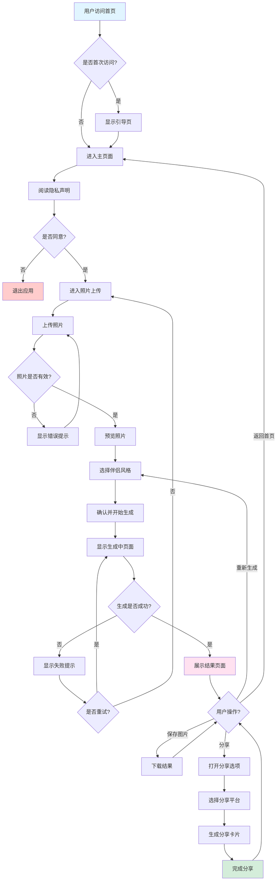
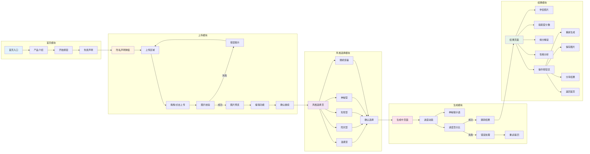
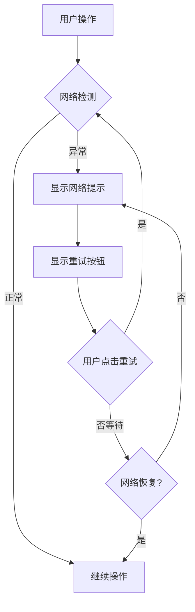
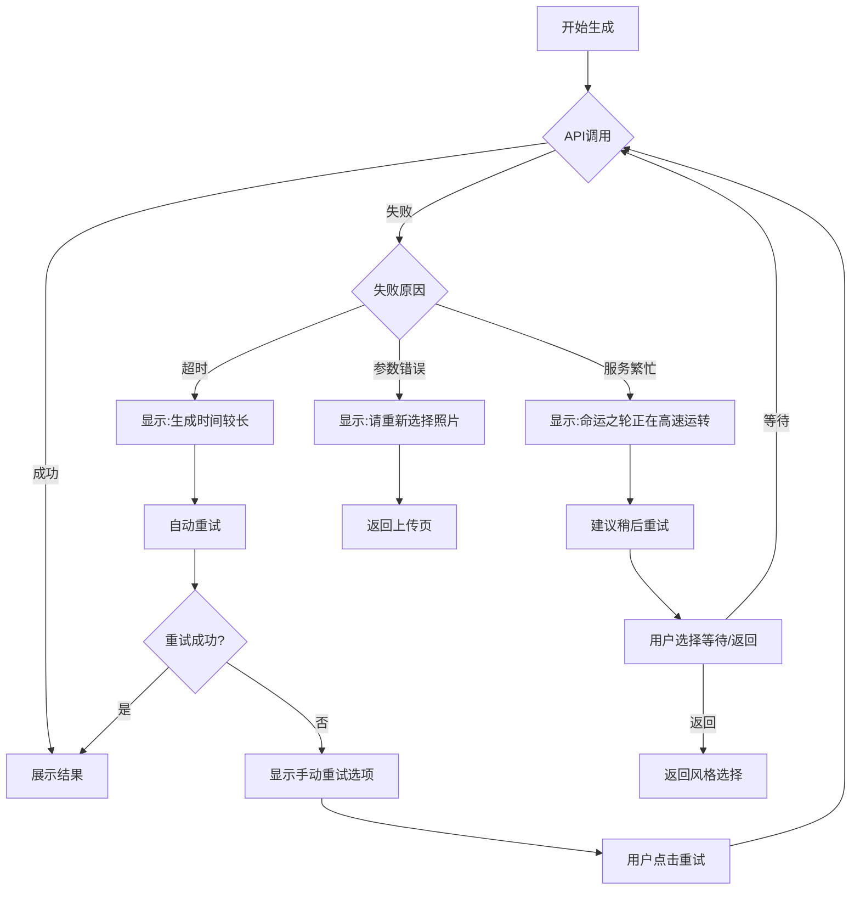
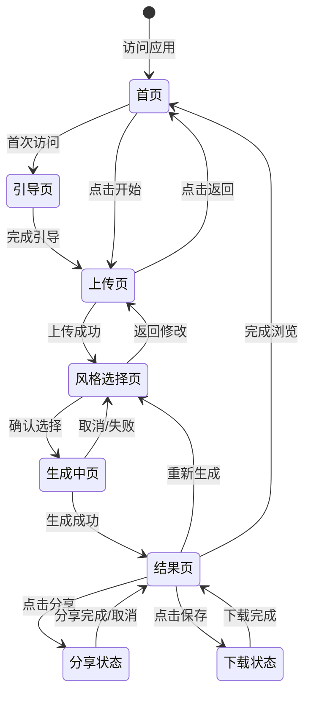

# 命运匹配 (Destiny Match) - 用户交互流程文档

> 版本：v1.0
> 更新日期：2026-02-16
> 状态：需求定义阶段

---

## 1. 用户旅程概述

### 1.1 核心用户旅程

```
发现应用 → 访问首页 → 了解产品 → 上传照片 → 选择风格 → 等待生成 → 查看结果 → 分享/保存
```

### 1.2 用户旅程地图

| 阶段 | 用户目标 | 用户行为 | 接触点 | 情绪曲线 |
|-----|---------|---------|--------|---------|
| 发现 | 寻找有趣的测试 | 通过朋友分享/社交媒体发现 | 分享卡片 | 😊 好奇 |
| 进入 | 了解应用 | 访问首页，阅读介绍 | 首页 | 🤔 感兴趣 |
| 参与 | 体验测试 | 上传照片，选择风格 | 上传页 | 😄 期待 |
| 等待 | 看到结果 | 等待生成 | 生成页 | ⏳  suspense |
| 收获 | 获得结果 | 查看照片和分析 | 结果页 | 😍 惊喜/开心 |
| 传播 | 分享结果 | 分享到社交媒体 | 分享功能 | 🥳 满足 |

---

## 2. 核心交互流程图

### 2.1 整体流程图



### 2.2 详细页面流程图



---

## 3. 各页面详细交互说明

### 3.1 首页 (Home)

#### 页面布局
```
┌─────────────────────────────────────┐
│           [星空背景动效]             │
│                                     │
│            ✨ 命运匹配 ✨            │
│                                     │
│    探索你的缘分，预见未来的TA        │
│                                     │
│         [命运之门动画]               │
│                                     │
│      ┌─────────────────┐           │
│      │   开启命运之门   │           │
│      └─────────────────┘           │
│                                     │
│    💫 已帮助 12,345 人找到缘分      │
│                                     │
│    免责声明：本应用仅供娱乐         │
└─────────────────────────────────────┘
```

#### 交互说明
| 元素 | 交互 | 反馈 |
|-----|------|-----|
| 开启按钮 | 点击 | 按钮发光动效，跳转上传页 |
| 背景 | 自动 | 星空粒子缓慢飘动 |
| 统计数字 | 自动 | 数字滚动增加效果 |

---

### 3.2 隐私声明页 (Privacy)

#### 页面布局
```
┌─────────────────────────────────────┐
│           🔒 隐私保护               │
├─────────────────────────────────────┤
│                                     │
│  在您开始之前，请了解我们的承诺：    │
│                                     │
│  ✅ 您的照片仅用于本次生成          │
│  ✅ 照片不会被保存到服务器          │
│  ✅ 生成完成后立即删除临时文件      │
│  ✅ 我们尊重并保护您的隐私          │
│                                     │
│  [查看完整隐私政策]                 │
│                                     │
│  ┌──────────┐  ┌──────────┐        │
│  │  不同意  │  │  我同意  │        │
│  └──────────┘  └──────────┘        │
│                                     │
└─────────────────────────────────────┘
```

#### 交互说明
| 元素 | 交互 | 反馈 |
|-----|------|-----|
| 不同意按钮 | 点击 | 显示提示"需要同意才能继续"，提供返回首页选项 |
| 我同意按钮 | 点击 | 按钮变色，进入上传页 |
| 隐私政策链接 | 点击 | 弹窗显示完整隐私政策 |

---

### 3.3 照片上传页 (Upload)

#### 页面布局
```
┌─────────────────────────────────────┐
│         ← 返回      步骤 1/3        │
├─────────────────────────────────────┤
│                                     │
│    上传你的照片                     │
│    让命运之轮开始转动               │
│                                     │
│    ┌─────────────────────────┐     │
│    │                         │     │
│    │    📷                   │     │
│    │                         │     │
│    │   点击或拖拽上传照片     │     │
│    │                         │     │
│    │   支持 JPG, PNG, WEBP   │     │
│    │   最大 5MB              │     │
│    │                         │     │
│    └─────────────────────────┘     │
│                                     │
│    💡 提示：清晰的正面照效果更好    │
│                                     │
└─────────────────────────────────────┘
```

#### 交互说明
| 元素 | 交互 | 反馈 |
|-----|------|-----|
| 上传区域 | 点击 | 打开系统文件选择器 |
| 上传区域 | 拖拽文件进入 | 区域高亮，释放后上传 |
| 文件选择 | 选择文件 | 校验文件格式和大小 |
| 返回按钮 | 点击 | 返回首页 |

#### 上传成功预览状态
```
┌─────────────────────────────────────┐
│         ← 返回      步骤 1/3        │
├─────────────────────────────────────┤
│                                     │
│    ┌─────────────────────────┐     │
│    │    [照片预览]            │     │
│    │                         │     │
│    │    [旋转按钮]            │     │
│    │                         │     │
│    └─────────────────────────┘     │
│                                     │
│    ✅ 照片质量良好                  │
│                                     │
│    ┌──────────┐  ┌──────────┐      │
│    │ 重新上传  │  │ 确认继续  │      │
│    └──────────┘  └──────────┘      │
│                                     │
└─────────────────────────────────────┘
```

#### 错误处理
| 错误类型 | 提示文案 | 操作建议 |
|---------|---------|---------|
| 格式错误 | "请上传 JPG、PNG 或 WEBP 格式的图片" | 重新选择 |
| 大小超限 | "图片太大啦，请压缩后再试（最大 5MB）" | 压缩图片 |
| 尺寸过小 | "图片尺寸过小，建议选择更清晰的图片" | 重新选择 |
| 上传失败 | "网络开小差了，请检查网络后重试" | 重试 |

---

### 3.4 风格选择页 (Style)

#### 页面布局
```
┌─────────────────────────────────────┐
│         ← 返回      步骤 2/3        │
├─────────────────────────────────────┤
│                                     │
│    选择你想要的伴侣风格             │
│    命运会为你指引方向               │
│                                     │
│    ┌────────┐ ┌────────┐           │
│    │  💕    │ │  ☀️    │           │
│    │ 温柔型 │ │ 阳光型 │           │
│    │ [选中] │ │        │           │
│    └────────┘ └────────┘           │
│                                     │
│    ┌────────┐ ┌────────┐           │
│    │  📚    │ │  🌙    │           │
│    │ 知性型 │ │ 神秘型 │           │
│    │        │ │        │           │
│    └────────┘ └────────┘           │
│                                     │
│    ┌────────────────┐              │
│    │    🎲 随机惊喜  │              │
│    │    (让命运决定) │              │
│    └────────────────┘              │
│                                     │
│         ┌──────────┐               │
│         │ 开始预测  │               │
│         └──────────┘               │
│                                     │
└─────────────────────────────────────┘
```

#### 交互说明
| 元素 | 交互 | 反馈 |
|-----|------|-----|
| 风格卡片 | 点击 | 卡片选中效果（发光/边框高亮） |
| 随机选项 | 点击 | 四个风格卡片快速轮播后随机选中一个 |
| 开始预测按钮 | 点击 | 按钮动效，进入生成中页面 |
| 返回按钮 | 点击 | 返回上传页 |

#### 风格说明弹窗
| 风格 | 点击后显示 |
|-----|-----------|
| 温柔型 | "如春风般温暖的 TA，善解人意，会给你最贴心的陪伴" |
| 阳光型 | "充满活力的 TA，笑容灿烂，会带你探索世界的美好" |
| 知性型 | "聪慧内敛的 TA，思想深邃，能与你进行灵魂对话" |
| 神秘型 | "独特迷人的 TA，有着神秘的魅力，让生活充满惊喜" |

---

### 3.5 生成中页 (Loading)

#### 页面布局
```
┌─────────────────────────────────────┐
│           步骤 3/3                  │
├─────────────────────────────────────┤
│                                     │
│         [神秘动画效果]              │
│         ✨ 水晶球旋转 ✨            │
│              🔮                     │
│                                     │
│    ━━━━━━━━━━━━━━━━  65%           │
│                                     │
│    "正在翻阅月老的红线簿..."        │
│                                     │
│    [随机切换的提示语]               │
│                                     │
│    预计还需 8 秒                    │
│                                     │
│    ┌──────────┐                    │
│    │  取消预测  │                   │
│    └──────────┘                    │
│                                     │
└─────────────────────────────────────┘
```

#### 进度提示语（随机显示）
- "正在翻阅月老的红线簿..."
- "星辰正在为你排列..."
- "命运之轮开始转动..."
- "月老正在系红线..."
- "前世今生的画面正在浮现..."
- "TA 的轮廓正在显现..."
- "缘分正在穿越时空..."
- "命中注定的那颗星正在闪耀..."

#### 交互说明
| 元素 | 交互 | 反馈 |
|-----|------|-----|
| 取消按钮 | 点击 | 确认弹窗"确定要取消吗？"，确认后返回风格选择 |
| 进度条 | 自动 | 平滑增长，配合提示语切换 |
| 完成 | 自动 | 完成后自动跳转到结果页 |

---

### 3.6 结果页 (Result)

#### 页面布局
```
┌─────────────────────────────────────┐
│         ← 返回首页                  │
├─────────────────────────────────────┤
│                                     │
│    ┌─────────────────────────┐     │
│    │                         │     │
│    │    [生成伴侣照片]        │     │
│    │                         │     │
│    │    温柔型 · 未来伴侣     │     │
│    │                         │     │
│    └─────────────────────────┘     │
│                                     │
│    ╔═══════════════════════╗       │
│    ║                       ║       │
│    ║      般 配 度         ║       │
│    ║                       ║       │
│    ║       87%            ║       │
│    ║                       ║       │
│    ║    ★ 天作之合 ★      ║       │
│    ║                       ║       │
│    ╚═══════════════════════╝       │
│                                     │
├─────────────────────────────────────┤
│         📜 缘分解读                 │
├─────────────────────────────────────┤
│                                     │
│  你们的灵魂有着奇妙的共鸣，相处时   │
│  总能找到共同话题，彼此欣赏...      │
│                                     │
│  [展开更多]                         │
│                                     │
├─────────────────────────────────────┤
│         💫 性格互补分析             │
├─────────────────────────────────────┤
│                                     │
│  • 你的稳重遇上TA的温柔...          │
│  • 你的理性与TA的感性完美平衡...    │
│  • 你们会在彼此身上找到缺失的那部分 │
│                                     │
├─────────────────────────────────────┤
│                                     │
│  ┌────────┐ ┌────────┐ ┌────────┐  │
│  │ 再测一次│ │保存结果│ │ 分享  │  │
│  └────────┘ └────────┘ └────────┘  │
│                                     │
└─────────────────────────────────────┘
```

#### 交互说明
| 元素 | 交互 | 反馈 |
|-----|------|-----|
| 照片 | 点击 | 放大预览 |
| 展开更多 | 点击 | 展开完整的缘分解读 |
| 再测一次 | 点击 | 返回风格选择页，保留照片 |
| 保存结果 | 点击 | 下载结果卡片到本地 |
| 分享 | 点击 | 打开分享选项弹窗 |
| 返回首页 | 点击 | 返回首页 |

#### 分享选项弹窗
```
┌─────────────────────────────────────┐
│           分享你的缘分              │
├─────────────────────────────────────┤
│                                     │
│  [分享卡片预览]                     │
│                                     │
│  ┌────────┐ ┌────────┐ ┌────────┐  │
│  │ 微信好友│ │ 朋友圈 │ │ 微博  │   │
│  └────────┘ └────────┘ └────────┘  │
│                                     │
│  ┌────────┐ ┌────────┐             │
│  │ 复制链接│ │保存图片│             │
│  └────────┘ └────────┘             │
│                                     │
│      ┌──────────┐                  │
│      │   取消   │                  │
│      └──────────┘                  │
│                                     │
└─────────────────────────────────────┘
```

---

## 4. 异常流程处理

### 4.1 网络异常流程



### 4.2 生成失败流程



### 4.3 照片处理异常

| 异常场景 | 用户提示 | 处理方式 |
|---------|---------|---------|
| 人脸检测失败 | "未能识别到清晰的人脸，请尝试其他照片" | 允许继续或重新上传 |
| 图片质量过低 | "图片有些模糊，可能影响生成效果" | 警告但允许继续 |
| 多张人脸 | "检测多个人脸，将使用最主要的人物" | 提示后自动选择 |
| 内容违规 | "请上传合适的个人照片" | 拒绝并提示重新上传 |

---

## 5. 状态流转图

### 5.1 应用状态机



### 5.2 页面状态流转表

| 当前状态 | 可能的下一个状态 | 触发条件 |
|---------|----------------|---------|
| 首页 | 引导页 | 首次访问 |
| 首页 | 上传页 | 点击"开始" |
| 引导页 | 上传页 | 完成引导 |
| 上传页 | 风格选择页 | 照片上传成功 |
| 上传页 | 首页 | 点击返回 |
| 风格选择页 | 生成中页 | 确认风格 |
| 风格选择页 | 上传页 | 返回修改照片 |
| 生成中页 | 结果页 | 生成成功 |
| 生成中页 | 风格选择页 | 取消/失败 |
| 结果页 | 风格选择页 | 重新生成 |
| 结果页 | 首页 | 返回首页 |

---

## 6. 动效和过渡设计

### 6.1 页面过渡动效

| 过渡 | 动效类型 | 时长 | 说明 |
|-----|---------|-----|------|
| 首页 → 上传页 | 淡入 + 向上滑动 | 400ms | 平滑过渡 |
| 上传页 → 风格选择 | 滑动切换 | 300ms | 左右滑动 |
| 风格选择 → 生成中 | 放大 + 淡入 | 500ms | 营造神秘感 |
| 生成中 → 结果页 | 翻页效果 | 600ms | 揭晓答案的仪式感 |

### 6.2 微交互动效

| 元素 | 交互 | 动效 |
|-----|------|-----|
| 按钮 | 悬停 | 轻微放大 + 发光 |
| 按钮 | 点击 | 涟漪效果 |
| 卡片 | 选中 | 边框高亮 + 上浮阴影 |
| 进度条 | 更新 | 平滑增长动画 |
| 分数 | 显示 | 数字滚动增长 |
| 照片 | 加载 | 渐显 + 轻微缩放 |

---

## 7. 响应式设计

### 7.1 断点定义

| 断点 | 宽度范围 | 布局调整 |
|-----|---------|---------|
| 移动端 | < 640px | 单列布局，全宽按钮 |
| 平板 | 640px - 1024px | 双列网格，适中间距 |
| 桌面端 | > 1024px | 最大宽度限制，居中显示 |

### 7.2 移动端特殊处理

- 上传区域增大触摸区域（最小 44x44px）
- 风格选择改为垂直堆叠
- 结果页照片全宽显示
- 分享按钮固定底部

---

## 8. 可访问性设计

### 8.1 无障碍要求

- 所有图片包含 alt 描述
- 按钮有明确的 focus 状态
- 支持键盘导航（Tab 键切换）
- 颜色对比度符合 WCAG 2.1 AA 标准
- 支持屏幕阅读器

### 8.2 键盘快捷键

| 快捷键 | 功能 |
|-------|-----|
| Tab | 切换焦点元素 |
| Enter/Space | 激活选中元素 |
| Escape | 关闭弹窗 |
| Alt + ← | 返回上一页 |

---

*文档版本历史*
- v1.0 (2026-02-16): 初稿创建，包含完整流程图和交互说明
